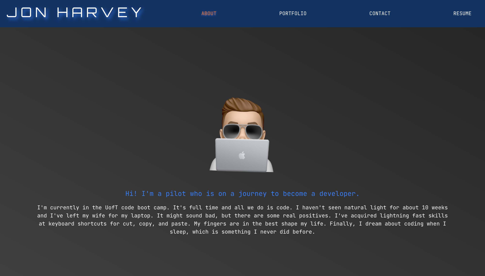

# Jon Harvey React Portfolio

## Background

This was a project for the UofT Bootcamp.

## Table of Contents
[Description](#description)\
[Motivation](#motivation)\
[User Story](#user-story)\
[Technologies](#technologies)\
[License](#license)\
[Process](#process)\
[Screen Shot](#screen-shot)\
[Links](#links)


## Description

We were tasked with updating our HTML portfolios into React apps.  The portfolio offers us a place to showcase our work to potential employers and developers.  However, we don't have a back-end on this app, so some functionality is lost.


## Motivation

Helps us to get familiar with React as well as cleanly render a multiple page site as a single page.  It also sets us apart from other developers by using one of the latest technologies for our portfolio.

## User Story

```md
AS AN employer looking for candidates with experience building single-page applications
I WANT to view a potential employee's deployed React portfolio of work samples
SO THAT I can assess whether they're a good candidate for an open position
```

## Technologies

* HTML, Bootstrap, & CSS
* JavaScript
* React


## License

[MIT License](https://choosealicense.com/licenses/mit/)

## Process

* For this project our previous portfolio was our starter code.
* I started with copying my previous HTML & CSS code into the React app.  Then I broke the HTML code into react components
* The biggest challenges for this project was getting use to React, but all in all it was a good experience.
* The successes for this project was breaking down the previous code into components to be used by React in a single page structure.
* Credit to my tutor, TA's, and classmates for their help.

## Screen Shot



## Links

Repository: https://github.com/harviator/jon-harvey-react-portfolio \
Deployed: https://harviator.github.io/jon-harvey-react-portfolio/